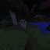
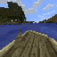

### [tl;dr: Compete to build AI in Minecraft! [NeurIPS 2020 Competition]](/competition)
### [tl;dr: Use the MineRL reinforcement learning environment!](/docs)
### [tl;dr: Get the MineRL dataset!](/docs)
### [tl;dr: Play Minecraft to benefit Science!](/play)

Welcome to MineRL. We want to solve [Minecraft](http://minecraft.net) using state-of-the-art Machine Learning! To do so, we have created one of the largest imitation learning datasets with **over 60 million frames** of recorded human player data. Our dataset includes a set of tasks which highlights many of the hardest problems in modern-day Reinforcement Learning: sparse rewards and hierarchical policies. 

    

        <b>Navigate:</b>
    

    
        
    
    
        
    
    
        
    
    
        
    
    
        
    
    
        
    
    
        
    
    
        
    
    

    

        <b>Obtain:</b>
    

    
        
    
    
        
    
    
        
    
    
        
    
    
        
    
    
        
    
    
        
    
    
        
    
    

    

    

    
        
    
    
        
    
    
        
    
    
        
    
    
        
    
    
        
    
    
        
    
    
        
    
    

    

        <b>Survival:</b>
    

    
        
    
    
        
    
    
        
    
    
        
    
    
        
    
    
        
    
    
        
    
    
        
    

Get involved
------------

Our project consists of three main components:

* [A free, public Minecraft server for collecting data](/play/index.html)
* [The expansive MineRL dataset](/dataset/index.html)
* [Tools for research on MineRL-v0 dataset](/docs/index.html)
